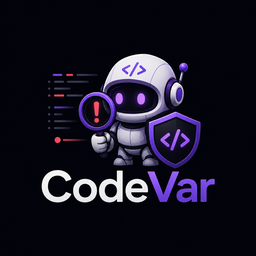
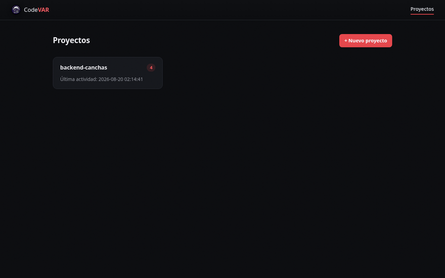

<p align="center">
  
</p>

<h1 align="center">CodeVAR</h1>

<p align="center">
  Mini error-tracker para aplicaciones Python/FastAPI, inspirado en Sentry.
</p>

<p align="center">
  <strong><a href="https://codevar.onrender.com">codevar.onrender.com</a></strong> — demo en vivo
</p>

---

## Qué es

CodeVAR captura excepciones no manejadas en una app FastAPI, las agrupa por huella (mismo tipo de excepción + mismo archivo + misma línea) y las expone en un dashboard web con frecuencia, último visto y stack trace completo — todo sin depender de una herramienta cerrada como Sentry.

El nombre hace referencia al VAR (Video Assistant Referee) del fútbol: así como el VAR revisa jugadas en busca de faltas, CodeVAR revisa el código en producción en busca de errores.

Es un proyecto personal de **David Cepeda**, estudiante de Ingeniería de Software (Universidad de las Fuerzas Armadas ESPE), construido para entender de primera mano cómo funciona la observabilidad en producción — captura de excepciones, deduplicación de eventos, diseño de una API de ingesta — y como pieza de portafolio. No busca competir con Sentry: es deliberadamente mínimo y de un solo lenguaje (Python/FastAPI).

## Cómo funciona

```
Tu app (FastAPI)
      │  excepción no manejada
      ▼
codevar-client   →  middleware que captura la excepción, extrae
                     tipo/archivo/línea del traceback y la reporta
      │  POST /api/events
      ▼
codevar-server   →  API de ingesta + agrupación por fingerprint
      │
      ▼
  PostgreSQL      →  proyectos, grupos de error, eventos individuales
      │
      ▼
  Dashboard web    →  overview de proyectos, lista de errores,
                       detalle con stack trace, marcar resuelto/ignorado
```

## Demo

Flujo real (no simulado): se crea un proyecto, se conecta una app FastAPI real (`backend-canchas`), ocurre un bug genuino en producción, y aparece en el dashboard.



## Prueba tu propia app

1. Entra a [codevar.onrender.com](https://codevar.onrender.com) y crea un proyecto (**+ Nuevo proyecto**) — te muestra la `api_key` generada.
2. Instala el cliente en la app FastAPI que quieres monitorear:
   ```bash
   pip install -e /ruta/a/codevar-client
   ```
3. Agrega el middleware (el propio dashboard te da este snippet con tu `api_key` ya completada):
   ```python
   from fastapi import FastAPI
   from codevar_client.middleware import CodevarMiddleware
   from codevar_client.config import CodevarConfig

   app = FastAPI()

   app.add_middleware(
       CodevarMiddleware,
       config=CodevarConfig(
           server_url="https://codevar.onrender.com",
           api_key="la-api-key-de-tu-proyecto",
       ),
   )
   ```
4. Cualquier excepción no manejada en un endpoint aparece sola en tu dashboard, agrupada por tipo/archivo/línea.

## Repositorios de este monorepo

| Carpeta | Qué es |
|---|---|
| [`codevar-server`](codevar-server/) | API de ingesta + dashboard (FastAPI + PostgreSQL + Jinja2) |
| [`codevar-client`](codevar-client/) | Middleware/SDK instalable vía pip en otros proyectos FastAPI |

## Documentación

- [`Contexto.md`](Contexto.md) — contexto completo del proyecto, decisiones de alcance ya tomadas
- [`Planning.md`](Planning.md) — plan de desarrollo por fases y convención de commits
- [`codevar-server/README.md`](codevar-server/README.md) — setup y stack del servidor
- [`codevar-client/README.md`](codevar-client/README.md) — instalación y uso del SDK

## Stack técnico

| Capa | Tecnología |
|---|---|
| Backend / API | FastAPI |
| Base de datos | PostgreSQL |
| ORM | SQLAlchemy |
| Dashboard | Jinja2 (server-rendered, sin frontend framework) |
| Cliente/SDK | Paquete Python instalable (`pip install -e`) |
| Despliegue | Render |

## Alcance (a propósito limitado)

- Un solo lenguaje/framework: **Python + FastAPI**. No hay SDKs para otros lenguajes.
- Fingerprinting simple: `hash(tipo_excepción + archivo + línea)`. Sin análisis semántico avanzado.
- Sin autenticación de usuarios ni alertas por email/Slack — fuera del alcance del MVP.

Ver [`Contexto.md`](Contexto.md) para el detalle completo de estas decisiones.
